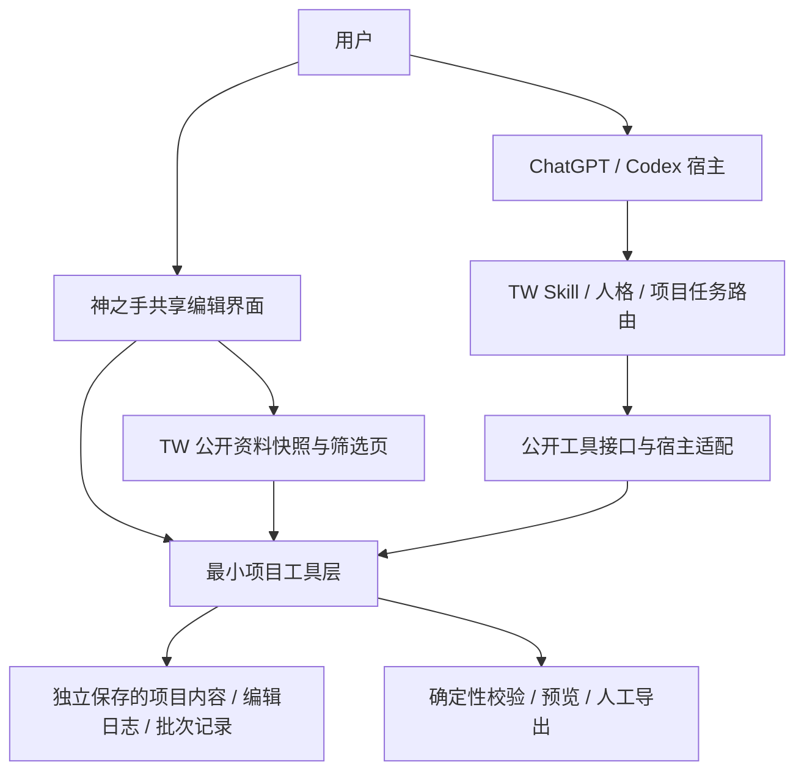

# TavernWeave 神之手大更新 · 总设计案

> **已移交，本文冻结为 0.1.2 历史。** 神之手活动设计与当前状态已移入独立新仓，请读取新仓 NEXT（本机路径：`E:/OneDrive/ST-/RPN-GodHand/NEXT.md`）。此路径是本机交接位置，远端尚未创建。下文“当前”“下一步”“未建仓”等均描述移交前状态，不再作为神之手当前执行指令。

神之手提供用户能亲手编辑、保存、筛选资料、安排长任务并导出作品的创作前端，TW 提供创作与开发方法，宿主 Agent 提供推理、会话和执行能力。本次路线以替代原 RPN 神之手的独立 Agent IDE 开发为目标，减少单人长期维护范围。

本文记录已确认的产品要求和待审阅的工程方案。驾驶员已授权编写设计案、蓝图和更新/新仓工作区计划；尚未授权功能实施，也未验收整份设计。文档版本 `0.1.2` 仅用于文档修订，TW 正式产品仍为 `1.5.0`，神之手的产品版本号尚未指定。本次修订确认独立私有新仓与目录布局，并展开建仓、权威交接和双方更新计划。

## 1. 权威、范围与本轮状态

当前续接入口继续使用根 [UPDATE_PLAN_CANDIDATE.md](../../UPDATE_PLAN_CANDIDATE.md) 第 20 节，它承担本项目的 NEXT 职责；不再创建第二份根 NEXT。本文负责产品目标与合同，[实施蓝图](实施蓝图.md)负责阶段、交付物、验证和退出条件。

本次写入只包括总设计案、实施蓝图、[更新与新仓工作区计划](更新与新仓工作区计划.md)和现有续接入口。原 RPN 仓库、历史成果、真实客户端配置、TW Skill 实现、公开版本和发布记录均不在本次写入范围。原 RPN 的停止开发方向已经明确；正式归档及其权威文件更新留到替代验证后处理，不能把本文冒充已经执行了跨仓归档。

本次为大更新，既有 Skill 能力继续可独立使用。神之手是 TW 配套的可选产品界面，不要求只使用 Skill 的用户启动前端、迁移项目或安装新的运行服务。

## 2. 已确认的产品决定

下列 C 编号来自本次驾驶员对话；后文实现方法为提案，不能倒推为驾驶员已经选择了某种技术栈。

| 编号 | 已确认内容 | 对设计的约束 |
|---|---|---|
| C01 | 可行性验证通过后，结束原 RPN 专业 Agent IDE 开发路线 | 新方案以减轻单人维护为目标，不保留两条并行扩张的产品线 |
| C02 | 在宿主非破坏性更新中保持长期稳定 | 使用公开接口、独立项目数据和明确的支持范围；更新后必须实测 |
| C03 | 首批 ChatGPT/Codex，后续 Claude、zcode、DSH | 首批两个宿主分别验证；后续宿主不成为原 RPN 收口的前置条件 |
| C04 | 抽取神之手功能，用户可以直接编辑，包括 UI 编辑器 | 前端承担实际修改、保存和预览；不能只有聊天按钮或只读看板 |
| C05 | 同一内容默认由人和 Agent 分时接手 | 对话停歇、写入确已停止后，人编辑；保存结束后 Agent 接续 |
| C06 | Agent 根据编辑日志和编辑后的数据继续 | 自动记录修改，不让用户手写交接账；当前数据是内容权威 |
| C07 | 同一项目不同内容允许人和 Agent 并行 | 例如 Agent 做前端，人润色世界书；重叠内容必须交接 |
| C08 | 稳定性包括人工导出 | 保存、预览、人工导出属于确定性能力，不依赖模型回复 |
| C09 | 小说转资料库是明确需求；先调研和测 token，再自动批量落库 | 样本试验用于选质量、用量和分工方案，不重新论证自动化是否值得 |
| C10 | 长落库任务允许无人值守；视觉库保留选材判断 | 批次不反复询问；在约定边界内持续运行并可恢复 |
| C11 | 提供 TW 人格模式的启用、切换与关闭 | 模式入口连接真实 TW 行为，状态不能由按钮颜色伪造 |
| C12 | 制卡创作和 Vibe 开发是两条主要方向 | 两条路径都进入本次大更新，不把 Vibe 开发藏进后续待办 |
| C13 | 提供 TW 内置资料库和筛选页 | 复用现有公开快照、筛选与选择能力，并接入项目上下文 |
| C14 | 提供项目专用 sub-agent 路由分配机制 | 项目定义分工；实际子 Agent 运行尽量交给宿主 |

### 2.1 提案中

| 编号 | 工程提案 | 验证位置 |
|---|---|---|
| T01 | 一套前端、一个最小项目工具层、按能力接入宿主 | 蓝图 P0、P1、P6 |
| T02 | 本地优先的可编辑项目文件，缓存可重建，版本与变更日志独立保存 | P1 的重开、交接、导出与恢复验证 |
| T03 | 官方支持时嵌入宿主；否则打开同一套完整编辑页面 | P0 按宿主实测，不能用另一套概念页代替 |
| T04 | 先选一个主验证宿主打通闭环，再完成另一个首批宿主的适配 | P0 冻结具体客户端和运行模式，P6 验证第二宿主 |
| T05 | 把子任务合同映射到宿主原生子 Agent；不支持时串行执行 | P4 的质量与用量试验、P5 的恢复验证 |
| T06 | 一份主实施蓝图承载四个领域，必要时经确认再提取领域蓝图 | 本轮文档拓扑，不预建空白子蓝图 |

原 T07 的独立新仓方向已获确认，转入下方 R01–R03；有限接口、固定快照与交叉更新仍按第 9.1 节及 P0/P6 实现和验证，不把方向确认当作兼容性已经通过。

### 2.2 待决定

| 编号 | 未决事项 | 最迟决定点 |
|---|---|---|
| O01 | 大更新产品版本号、神之手最终对外名称及是否采用独立插件条目 | P6 发布准备前；本文不擅自定为 2.0.0 |
| O02 | ChatGPT/Codex 首批支持的具体客户端、运行模式、主验证宿主 | P0；不能把某个桌面场景通过写成全端通过 |
| O03 | 本地工具的启动/连接办法，以及远程宿主如何访问授权项目 | P0；任何部署、隧道或远程上传另有明确范围 |
| O04 | 原 RPN/UI Builder 可复用源码的准确版本与最小抽取边界 | P0；需要对齐来源源码、外部真相源和历史证据 |
| O05 | token 样本的具体材料、宿主/模型、可见用量字段和本轮预算 | P4；当前没有新试验数据或节省比例 |
| O06 | zcode 的确切产品与版本、后续 Claude 的具体承载面 | 后续适配开工前；不凭简称猜接口 |
| O07 | 远端账户/仓名可用性核对、建仓及权威交接的具体执行范围 | P0 产品源码落盘前；独立新仓、私有起步与目录已确认，实际创建/迁移未执行 |

### 2.3 已否决

- 继续同时维护原 RPN 大型 IDE 和一套同等复杂度的新神之手。
- 默认允许人和 Agent 同时改同一内容，再依赖自动合并解决创作冲突。
- 用聊天记忆、人格状态、Widget 缓存或浏览器临时存储充当作品的唯一保存位置。
- 把 UI 人格切换等同于三个独立子 Agent，或自动更改用户引导挡位。
- 只按文件数、覆盖率或输出字数判断资料库质量；提前宣称多 Agent 更省 token。
- 将小说转库的批量授权套用到视觉库长期下载、裁切和导入。

本轮是定位、编辑方式和新增入口的文档收束。主方向按 foundational 四轮封顶记录为 `4/4`，剩余扩展轮次为 `0`；设计审阅可以修正本文，新增产品方向另行收束。

### 2.4 已确认的仓库与工作区选择

| 编号 | 已确认选择 | 状态边界 |
|---|---|---|
| R01 | 使用独立 `RPN-GodHand` 新仓，TW 与神之手分别维护和更新 | 本轮授权规划；未创建本地/远程仓库，未迁移活动权威 |
| R02 | 新仓先私有，首个可用版本稳定后再决定公开 | 不自动公开；产品显示名、正式版本和插件条目仍按 O01 决定 |
| R03 | 源码 `E:\OneDrive\ST-\RPN-GodHand`，Git 元数据 `E:\LocalGit\RPN-GodHand.git`，测试构建 `E:\Test Area\RPN-GodHand` | 目录布局已选定；本轮现场核对三处路径均未创建 |

R 编号记录实施位置与维护安排，不改变 C01–C14 产品要求和 AT01–AT24 验收范围。具体更新分工、初始文件、交接顺序与恢复见[更新与新仓工作区计划](更新与新仓工作区计划.md)。

## 3. 用户价值、产品边界与核心循环

目标用户可以熟悉创作而不熟悉工程，也可以熟悉 Vibe 开发但不希望自己维护 Agent 运行底座。界面围绕作品与任务组织，首次使用不要求先学 Skill 名、模型路由术语或内部状态机。

核心循环：选方向并打开项目 → 按需选择人格和资料 → 给 Agent 安排一项工作 → 用户在停歇时编辑，或处理独立内容 → 保存并交接 → Agent 读最新数据继续 → 用户检查、人工导出。小说长任务在确认样本方案和本轮边界后转为自动分批处理。

| 层 | 本次责任 | 不承担的责任 |
|---|---|---|
| 宿主 Agent | 推理、会话、上下文、宿主支持的工具与子 Agent 执行 | 不成为作品唯一数据源 |
| TW Skill 与项目规则 | 方法、领域路由、人格、资料检索、任务输入输出约束 | 不自建模型网关或通用 Agent 调度运行时 |
| 神之手前端 | 人工编辑、UI 编辑、筛选、交接状态、任务进度、人工导出 | 不复制通用 IDE、终端、模型商店和任意工作流画布 |
| 最小项目工具层 | 读写项目、版本校验、日志、校验/组装/导出、批次记录 | 不扩张为云同步平台、用户系统、向量库或后台模型代理 |

独立模型 Provider 管理、跨模型 Atlas、通用 Agent IDE、凭据金库、任意命令执行控制台、Workshop 生产业务、云端协同及自动发布均不进入本次神之手核心。既有 TW 专业 Skill 可继续服务对应任务，不意味着前端必须为每个 Skill 建一个页面。

## 4. 界面与两条创作路径

### 4.1 入口与导航

建议提供五个稳定入口，页面数量按实际组件复用调整，不绑定具体 UI 框架：

| 入口 | 用户主要操作 | 必须可见的真实状态 |
|---|---|---|
| 项目首页 | 选择制卡创作/Vibe 开发、新建或继续项目、切换人格 | 当前项目、方向、宿主连接、人格实际状态、最近保存 |
| 创作工作台 | 编辑条目或文件、查看本次差异、交接给 Agent | 当前编辑对象、谁在处理、未保存内容、待接续修改 |
| UI 编辑器 | 编辑真实组件、布局、样式与数据绑定，预览结果 | 已保存源稿、预览对应版本、编译失败及保留的草稿 |
| 资料库与筛选 | 检索、分类过滤、详情/预览、选入当前项目 | 快照版本、来源、实验标记、已选候选 |
| 任务与成果 | 安排/暂停/续跑长任务，查看结果，人工导出 | 真实进度、用量是否可计量、问题清单、导出版本 |

人格切换器、当前方向和保存状态可以常驻。主界面用大白话显示“你正在编辑”“Agent 正在处理前端”“有修改等待 Agent 接续”，内部哈希和任务 ID 放详情。操作失败保留草稿并说明下一步，不用“成功”通知遮住失败。

### 4.2 制卡创作

支持从零创作与接手旧卡两种进入方式。读取现有卡和维护材料后，用户能编辑人物设定、世界书条目、开局与提示内容；变量、正则、脚本和前端按现有专业工具能力呈现与校验。明确原件、维护项目、测试导出和真实酒馆产物之间的关系。

首次闭环至少完成一个条目的人工修改、一项 Agent 接续修改、一项真实 UI 组件编辑及相应预览，最后从已保存版本导出可继续编辑的项目包和角色卡产物。导出格式依据来源编解码能力冻结；卡源 JSON 与 PNG 载荷一致性必须能验证。真实酒馆门绑定这次输出，不借旧成品的导入结果抵账。

### 4.3 Vibe 开发

支持从想法形成小项目以及接手已有项目两种方式，使用项目现有权威、目录和检查命令。神之手提供需求/任务视图、有限的文本/结构化内容编辑、UI 编辑与预览、差异和成果导出；复杂代码导航、终端、调试、Git 工作树继续由宿主或用户已有工具承担。

首个样本建议选一个有实际界面的本地小项目，完成“用户改文案/需求 → Agent 根据修改继续开发 → 预览 → 导出可继续开发的源码”。这是首轮验收样本，不把 Vibe 开发的长期能力限制成只做网页。

切换方向只改变入口与方法路由，不自动转换项目格式、不另造内容副本，也不取消已有任务。混合项目可在同一项目内使用两条路径，但每次写入仍有明确对象与边界。

## 5. 人格启停与 TW 行为连接

人格合同复用 [Soul Skill](../../skills/activate-tavernweave-soul/SKILL.md)和[现有模式合同](../../skills/activate-tavernweave-soul/references/mode-contract.md)，本次编写设计不激活其中任何模式。

| 界面选择 | 现有模式标识 | 主要作用 |
|---|---|---|
| 普通 TW / 关闭人格 | `inactive` | 使用一般 TW 沟通与工程路由 |
| 阿瞳 | `atong-portable` | 温和引导，帮助开始与继续创作 |
| MTTT.sir | `mttt-sir-portable` | 严格训练、追问理解与证据 |
| 灵魂杀手 | `soul-killer-portable` | 以已披露的强尼·银手同人彩蛋人格进行证据审查 |
| 三席联席 | `soul-ensemble-portable` | 同一 Agent 的三种脑暴视角，共享事实与决定 |

按钮必须连接“用户发起切换 → 宿主执行对应 Skill → 返回本任务的加载结果”。技术上如何获得可信的调用与回执，由 P0/P2 实测后冻结，本文不发明宿主 API。不能仅修改 localStorage 或一段提示词，就显示已加载 Skill。

界面区分“未启用、请求中、已启用、失败、待核实”。请求序号、任务身份和实际模式需要对应；迟到的旧回执不能覆盖用户较新的选择。宿主断开或新任务尚未确认时显示待核实，不继续冒用上一个任务的“已启用”。仅能复制指令的宿主可以提供复制入口，但标为人工连接方式，不能通过完整启停验收。

人格状态默认延续 TW 现有的当前任务级 Portable 边界。可显示上次选择，但自动跨任务激活、全局持久化、跨设备继承属于额外能力，需真实支持与单独选择。退出人格不取消已授权的工程任务；取消任务是另一项明确操作。

人格、制卡/Vibe 方向、用户的新人/入门/熟练/老手挡位、文本精修状态分别管理。普通大白话规则持续生效。更换人格不改变权限、预算、模型分工或无人值守任务的已冻结规则；三席联席不触发三个真实 worker。人格素材遵守现有公开内容与授权边界。

## 6. TW 内置资料库与筛选页

复用 [Library Skill](../../skills/consult-tavernweave-library/SKILL.md)、[现有筛选页](../../skills/consult-tavernweave-library/assets/picker/index.html)及其同源脚本/样式。当前源码可核对的公开快照版本为 `2026-08-18`，路由回执列出设计 462、动效 194、概念 86、蒸馏账本 1,609 条。数量仅为来源快照事实；界面运行时读取 manifest，不把这些数值写死成新产品指标。

需要保留 ST 指南、设计、动效、概念、账本、外部源站和已选列表；支持搜索、现有标签/状态过滤、详情、可用本地预览、来源链接及选择清单导出。首版不通过重新画几张示例卡片冒充接入完整筛选页。

把筛选页从“复制候选 JSON”接到“带入当前项目”：

1. 用户选中候选，保持现有 `tavernweave-library-selection`、`state: proposed` 与快照版本语义。
2. 将项目选择与全局浏览选择分开，按稳定 ID 保存到该项目；不把私人正文写入公共目录。
3. Agent 只读取本次选择相关的最小资料，收到 ID、版本、来源和所需摘取内容，不把完整目录塞进上下文。
4. 从候选到采用是明确的项目决定；选择不自动下载、安装依赖、获得商业授权或改变作品。
5. 快照升级时保留项目选择。ID 消失、内容改变或预览缺失要可见，不静默替换为名称相似的条目。

TW 内置公开资料与用户从小说生成的项目资料分开存放、分开检索来源。项目库可以在相同界面打开，但不能混入公共发布快照。既有 Library 私有材料排除规则继续生效；不新增私有资料采集或分发范围。

## 7. 编辑交接、数据与人工导出

### 7.1 分时与分工规则

“对话停歇”必须落实为对应内容没有进行中的写入。Agent 停止输出文字但仍有子任务修改文件时，不能向用户显示该内容已可接手。

默认流程：Agent 完成本轮并释放编辑范围 → 用户编辑 → 保存成功 → 点击继续或发出继续请求 → Agent 读取此范围自上次接手后的日志和最新数据 → 继续。用户仍有未保存修改时，明确提示先保存，不能悄悄把草稿交给 Agent。

同一项目允许对象不同的并行编辑，例如 `frontend/*` 与某组世界书条目。范围按实际存储边界判断：若不同条目最终共写一个聚合 JSON，必须由同一工具层串行合并到最新文件；在做不到安全合并时锁住该文件，不能用逻辑 ID 不同掩盖物理写入冲突。共用变量、索引和最终组装需要检查依赖并按确定版本执行。

同一对象以一个写入者为基本规则，不做实时共同编辑或字符级多人合并。保留最小写入占用信息和版本校验即可；除非真实故障证明必要，不引入分布式锁、CRDT 或原 RPN 的整套 Operation Runtime。

### 7.2 最小数据对象

| 对象 | 最少需要表达的内容 | 责任 |
|---|---|---|
| Project | 稳定项目 ID、方向、格式版本、内容位置、最近提交的版本 | 项目工具层 |
| EditRecord | 人/Agent、修改对象、前后版本、差异引用、时间、可选意图 | 每次成功保存自动生成 |
| TaskSpec | 项目、目标、读写范围、输入版本、输出要求、依赖、执行与预算边界 | TW/项目路由生成，工具层校验 |
| BatchRecord | 批次 ID、原文/规则指纹、尝试次数、进度、结果/证据引用 | 长任务进度与恢复 |
| LibrarySelection | 快照版本、候选 ID、项目内采用状态 | 项目与筛选页 |
| ExportReceipt | 导出类型、源版本、资源清单、文件大小/哈希、校验结果 | 确定性导出工具 |

以上是合同草案，不表示现在新增数据库或六套服务。P1 优先验证普通文件、少量元数据和可重建索引能否满足需求，再决定必要依赖。

项目内容是唯一作品权威；编辑日志用于解释变化，聊天用于交流。日志引用的差异和前后版本应可读回。Agent 续接要核对最新对象版本；旧任务回写版本不符时返回冲突，不覆盖用户修改。跨项目迟到结果同样拒绝写入。

保存成功只在内容与相应日志可恢复地记录后返回。先写草稿或临时文件、验证，再切换有效版本；突然中断不能产生“日志说成功但内容未保存”的假状态。发现用户通过外部编辑器修改了文件而没有对应日志时，记录外部变化待核对并基于实际内容生成差异，不能假定无人改动。

### 7.3 人工操作与导出

人工打开、编辑、保存、预览和导出不依赖模型回复或付费推理。完整人工入口要能自行启动同一套项目工具，不能要求先有一段活跃的 Agent 对话。基础运行依赖的交付方法由 P0 决定，不把“零模型调用”误写成“零运行依赖”。

| 导出 | 内容与用途 | 最低检查 |
|---|---|---|
| 可编辑项目包 | 源稿、必要资源、项目元数据、续接所需日志/索引 | 新位置重新导入后可继续编辑；不依赖原机器绝对路径 |
| 制卡成品 | 本阶段支持的角色卡 JSON/PNG、世界书或组件输出 | 格式、必要字段、载荷一致性、资源引用与真实产物身份 |
| Vibe 项目源码 | 可继续开发的源码与必要说明/配置 | 新位置可读、引用正确；构建依赖与未包含部分明示 |
| 资料库 | 条目、来源定位、必要索引和悬项 | 出处引用可追溯；原文是否随包由用户范围决定 |

导出时取得已经保存的项目快照，确定包含的版本和资源；用户仍可在新的工作版本中继续修改。导出结果标明来源版本。写文件取消、磁盘错误、校验失败时不显示成功、不覆盖已有成品；部分文件保留为失败候选并可辨认。

存在外部资源时区分已打包资源、需在线访问的引用和缺失项；不宣称所有包天然完全离线。导出私人原文需明确包含范围；工具不得为补齐引用擅自下载。项目包不夹带密钥、聊天历史或未选择的资料。数据工具失效时要有文档化的项目文件备份/恢复办法。

## 8. 小说转库、token 试验与项目子 Agent 路由

### 8.1 按交付需要组织资料

原始小说 → 脚本建立章节/别名/位置索引 → 按任务导出必要片段 → 语义采证 → 专题/人物/事件整理 → 出处与冲突复核 → 可检索资料库 → 按需生成制卡材料。

索引、切片、文件整理、结构检查和去重优先由脚本承担；模型用于语义理解、创作判断和冲突分析。未经试验不把向量库、Embedding 服务或通用 RAG 平台作为前置依赖。用户选择全书库或特定专题库后，样本与预算按对应范围设计。

全球冰封作为本地案例来源：当前 `资料库3` 按制卡交付物组织，每条断言回原文章号，原文为权威，旧库只作定位线索，并区分开局/中后期信息。其 README 把实际设计问题作为验收考题，不把文件数作为完成度。本次仅采用这些方法；未重新审计全书，不复制其私人原文或资料到 TW 公共仓库。

条目至少包含内容、类型、实体/别名、时间或适用阶段、出处定位和事实状态。事实状态区分已证实、推测、待核实；原文叙述、角色说法和整理者推断不混写。目录连续也不能排除占位章、缺正文或错标标题；检测出的缺口进入问题清单，不自动编造补全。

### 8.2 先试验，再冻结运行方案

样本需要覆盖普通叙事、人物密集/别名、跨章时间或事实冲突、缺页/占位等代表情况。建议从全球冰封中选少量授权片段并加入未参与调参的保留样本。具体片段、任务数、宿主/模型及额度在 P4 开始前登记，当前不预报消耗。

比较方案至少包括单 Agent 顺序处理与少量专职子任务分工；保持材料、输出要求和验收问题可比。记录上下文/提示版本、工具开销、父任务汇总、子任务、重试、复核、缓存、耗时和人工返工。可见字段缺失时填未知，不用字符数冒充真实 token。

预算以宿主实际提供的计量为准。缓存 token 若是输入 token 的子集，不重复相加；推理 token 的计费归属按提供者实际口径记录。订阅额度、API 账单费用和可见 token 分开，不换算成未经证实的账户剩余额度。可量化时比较每份合格交付物的总用量与耗时，并给范围估计；不能仅用最省的一次外推全书。

质量至少检查出处是否支持断言、关键遗漏、同名/别名合并、时间和阶段错置、冲突是否显式保留、实际问题能否回答。先过质量底线，再选用量与时间合适的方案。模型分工和并发上限由试验决定，不以子 Agent 数量作为先进程度。

### 8.3 项目专用路由

项目配置指定任务角色、需要读的资料、允许修改的范围、交付要求、依赖和有限重试。可能的角色为原文采证、人物整理、时间线整理、出处复核；这是可按项目裁剪的工作分工，不是必建的四个长期 Agent。

前端/世界书并行任务同样使用这个范围合同。父任务只传递相关输入和任务摘要，避免给每个子任务复制整本小说或全部项目。子任务的输出先进入候选位置，由同一项目工具按最新版本校验后纳入正式数据。

宿主有可用且获准的子 Agent 能力时映射到原生执行；没有时保留同一任务合同串行完成。插件不能假设可以任意创建宿主会话、选择所有模型或读取计费信息。宿主权限继续生效；产品内“允许自动落库”不会绕过宿主审批。

### 8.4 无人值守运行

一轮开始时确定原文范围、输出位置、允许修改的对象、规则版本、执行方式、并发/重试上限、用量/时间边界和通知方式。该范围内的正常批次连续运行，不反复请求驾驶员确认。视觉库选材、长期下载、裁切和正式导入继续走原有明确确认流程。

任务建议使用待运行、运行中、暂停、等待输入、失败、完成六种用户可理解状态。宿主中断后先核对已有输出和批次记录，再决定续跑，不能将进程消失自动标为失败或完成。

每批保存原文与规则指纹、处理范围、尝试与结果。按稳定任务/批次身份识别已完成工作；输入或规则变化后，相关批次失效并重新评估，不能沿用旧完成标记。取消在安全的批次边界生效，已保存成果保留；迟到任务不得在取消后重新覆盖项目。

人工接管正在运行的内容时暂停对应范围；不受影响的任务可以继续。缺页、单个条目冲突等局部问题可挂账并处理独立部分；预算触顶、重复失败、权限改变、来源变化或无法保证保存一致性时暂停。

精确 token 上限只有在宿主计量与执行控制足以支持时才能承诺；无法计量时明确改用批次数、输入规模、调用次数或时长等可执行边界，并由用户选择是否继续。预计可能超出边界时，在启动下一批前预留额度，不等整批超支后再停。

运行能力声明要区分“用户离开界面时仍运行”“关闭会话后仍运行”“退出宿主后仍运行”。分别以真实宿主证据为准；首版至少实现所支持运行环境内的无人值守推进和中断后续跑，不暗中增加常驻云服务。状态无变化时安静；完成、需要决策、失败或资源边界触发时通知。若无法主动通知，界面必须明确说明实际通知渠道。

## 9. 跨宿主架构与更新稳定性

这是一套混合承载方案：`recommended: hybrid`，`fit: conditional`。用户确有编辑画布、资料筛选和交接需求，前端有明确价值；条件在于宿主的界面、工具连接、项目访问和生命周期支持。通用前端不以宿主 DOM 注入或私有内部对象为依赖。

截至 2026-09-13 查阅的官方文档，OpenAI 插件可组合 Skill 与 MCP 工具，MCP 工具可提供自定义 UI；ChatGPT 的 UI 文档建议优先采用 MCP Apps 标准，并对专有扩展检测实际能力。这支持本方案的研究方向，不证明所有客户端都能承载同一编辑器或有相同文件权限。[官方插件能力](https://learn.chatgpt.com/docs/plugins)、[MCP UI 指南](https://developers.openai.com/plugins/build/chatgpt-ui)

| 宿主 | 本次目标 | 已知证据与待验边界 |
|---|---|---|
| ChatGPT | 首批目标 | 官方有插件和自定义 UI 路径；具体客户端、持久项目访问和长任务能力待 P0 验证 |
| Codex | 首批目标 | 当前 TW 源码有 Codex 插件清单；神之手 UI、连接和后台边界仍待实测 |
| Claude | 后续适配 | TW 已有 Claude Code 包装；不据此声称神之手前端或 Claude 其他产品已适配 |
| DSH | 后续适配 | 现有 TW 合同仍标离线候选，审计快照为 0.1.0-rc.5；子 Agent/后台任务默认未包含 |
| zcode | 后续适配 | 产品身份与公开接口未确认，暂不承诺能力 |

优先维护一套界面和领域工具。宿主适配层只处理发现、调用、状态回传、文件/资源传递及实际支持的任务能力；按能力检测，不在业务代码中堆产品名称分支。

本地优先不等于远程 ChatGPT 可以直接读用户磁盘。P0 必须验证实际访问链：可用的本地宿主连接、明确授权的远程项目服务，或受限文件交接。若只能文件交接，就明确交接限制；不能据此声称已达成长任务与实时状态要求。若需长期自管远程后端，必须把运维成本列入减负评估后再决定。

更新需分别管理产品版本、工具接口版本、项目格式版本和资料快照版本。增加可选字段可以兼容旧项目；破坏性项目迁移必须有备份、验证与恢复路径。更新程序不覆盖用户项目、编辑记录、筛选选择和独立保存的偏好。

稳定验收包括支持的宿主旧/新版本、插件升级前后、关闭重开、恢复到上一个可用插件版本、不同宿主打开同一受支持项目包。无法继续运行时，至少保留项目内容和人工导出/恢复路径。不得宣称兼容所有未来版本；支持矩阵需要随实测维护。

### 9.1 独立仓库与双方更新隔离（方向已确认，兼容待验证）

驾驶员已选择独立 `RPN-GodHand` 新仓、私有起步及 R03 的目录布局。本轮完成更新与建仓规划，实际建仓尚未执行。仓库分离只隔离源码、测试和发布，运行时能否兼容仍由接口、版本和实际测试决定。下表保留选项比较及取舍依据。

| 选择 | 主要收益 | 维护代价与判断 |
|---|---|---|
| 继续放在 TW 仓库 | 初期跨目录修改方便 | 前端依赖、构建和发布容易与 Skill 更新绑在一起；不作为长期推荐 |
| 在原 RPN 仓库上继续改 | 原代码与历史都在 | 容易继承旧 IDE 的目录、依赖和未完成目标；仅作复用来源 |
| 独立神之手新仓库（已选） | 产品源码、依赖、检查和发布单独管理，边界清楚 | 多一个仓库和一份兼容记录；用有限接口控制这部分成本 |

| 所有者 | 唯一维护的内容 | 向另一侧提供什么 |
|---|---|---|
| TW 仓库 | Skill、Soul 公开合同、领域方法、公开资料快照、Picker 源码 | 经版本标记的能力/资料与明确兼容合同 |
| 神之手新仓库 | 共享前端、项目工具、人工编辑/导出、交接、长任务界面、宿主适配 | 用户可安装/使用的神之手产品及其支持表 |
| 原 RPN 仓库 | 旧源码、历史交付和验收证据 | 经审计后按需抽取的模块与经验；不作为新产品运行依赖 |
| 用户项目目录 | 创作内容、编辑日志、资料选择、批次与导出 | 由项目工具读写；不存入两侧安装目录或源码包 |

依赖方向保持神之手使用 TW 的公开能力，TW 的基础 Skill 不依赖神之手。神之手修前端不要求 TW 跟发版本；TW 改普通方法说明也不要求神之手重新打包。只有交界处的接口、数据或行为合同变化时才联动处理。

具体约束：

1. **有限接口**：只约定能力/版本发现、人格与任务意图、结果回执、资料选择/快照等必要交界。项目文件格式与编辑日志由神之手维护，TW 经公开工具访问，不直接耦合其内部目录、缓存或数据库结构。合同按提供者归属放在现有仓库，不额外创建通用 SDK/协议仓库。
2. **独立版本**：TW 版本、神之手版本、接口版本、项目格式和资料快照分别记录。两产品无需同号或同步发布；“这是一次大更新”不自动要求 TW 发布破坏性主版本。接口采用清晰的兼容规则，版本号不能代替真实行为验证。[语义化版本规范](https://semver.org/lang/zh-CN/)
3. **资料快照固定**：神之手发行物携带或引用经过验证的 TW 公开 Library/Picker 精确快照及哈希。只从公开允许范围自动取材，不手工维护另一套内容副本；旧神之手不会因 TW 最新目录更新而突然换掉自己的筛选数据。接纳新快照需要检查 ID、选择格式、来源链接和实际预览。
4. **宿主内 Skill 单一来源**：实际调用使用宿主已经发现的 TW Skill，并核对可观察的版本与必要能力。不另装一份隐藏的同名 Skill 来锁版本，否则会产生重复发现和行为歧义。宿主自动更新 TW 后，若组合未验证或不兼容，显示状态并限制受影响的 Agent 功能，保留人工项目操作；不能由插件擅自降级或改写用户安装。
5. **分开发布与回退**：两侧各自测试、打包和发布，神之手记录当前已验证组合及上一个可用组合。不能固定追随某个仓库的 `main` 或无版本 `latest` 作为运行依赖，也不以整仓互相嵌套/复制替代依赖合同。
6. **有限兼容测试**：至少验证当前神之手＋当前 TW、当前神之手＋候选 TW、候选神之手＋当前 TW。进入正式支持范围的升级组合还要验证项目、日志、选择、人格和人工导出。未知组合显示未验证；明确不兼容时阻止相关自动写入。合理限制兼容窗口，不承诺历史全版本永久交叉支持。

仓库决策与插件条目决策分别记录：独立源码仓库不代表已经验证宿主支持自动安装依赖插件，也不要求用户手动拼装内部包。P0/P6 再确认一次可操作的安装路径；没有公开机制时，使用清楚的依赖检查与安装指引，不发明插件依赖字段。

本次设计仍暂存在 TW 仓库。明确建仓执行范围后，在进入产品源码实施前迁移总设计案、实施蓝图和更新/工作区计划，并创建新仓自己的 NEXT，核对链接、来源与版本。TW 第 20 节保留历史摘要和新入口，明确其停止维护神之手当前状态；不让两仓同时拥有活动总设计案。旧文档与本轮证据保留为冻结历史，不删除旧 RPN 数据。迁移目标、先复制读回再切入口的顺序和失败恢复见[更新与新仓工作区计划](更新与新仓工作区计划.md)第 5 节；此项迁移尚未执行。

## 10. 首个可用版本与本次大更新终点

### 10.1 不能缺的核心骨架（Core Spine）

独立项目数据；分时交接和不同内容分工；模型无关的人工编辑/导出；TW 人格与方法路由；两条主要创作方向；真实 UI 编辑器；内置资料库与筛选；项目子任务与可恢复转库；公开宿主接口与升级验证。任意删去一项都要显式调整范围，不能用“轻量”偷偷省掉需求。

### 10.2 首个能亲手试用的成果（First Usable，P1–P3）

在 P0 冻结的一个真实主验证宿主中：选择方向 → 打开项目 → 实际启用/切换/关闭人格 → 筛选并带入资料候选 → 人工修改条目或文本 → Agent 根据日志与最新数据接续 → 编辑真实 UI 组件并预览 → 保存重开 → 人工导出。制卡和 Vibe 样本各跑一遍，允许共用同一套编辑、保存和导出能力。

必须含一次旧版本回写冲突的可理解处理。驾驶员亲手试用后提出一项实际修改，在其范围内修改并再次成功试用。P3 通过只说明首个可用成果成立，不能宣称整个大更新完成；自动转库与第二首批宿主仍在本次必做范围。

### 10.3 本次大更新的交付终点（至 P6）

- C01–C14 全部有对应证据；首批 ChatGPT/Codex 的支持范围逐项明确。
- P4 形成可复核的质量与 token 试验结论，P5 完成真实小规模无人值守落库及中断恢复。
- 人工导出不依赖模型；升级和恢复不丢项目、日志、资源引用与选择。
- 源码检查、真实宿主、驾驶员验收各自记录。原 RPN 归档、Git、打包、安装及正式发布按实际授权执行，不从设计门继承授权。

### 10.4 后续更新方向（Growth Tracks）

Claude/zcode/DSH 在首批闭环稳定、产品身份和接口明确后逐个适配；只有出现实际需求才增加深度代码编辑、更复杂的资料检索、跨设备项目同步或宿主外持续运行。它们不延长本次替代验证的完成分母。

### 10.5 暂存想法（Parking Lot）

任意工作流画布、多人实时协同、通用模型管理、公开云资料平台、自动商业素材采集、自动部署发布、永久跨宿主人格记忆。需要独立价值与维护成本论证后才重新讨论。

## 11. 旧成果复用账本

| 来源 | 当前检查与证据 | 初步决定 | 新责任与重验要求 |
|---|---|---|---|
| TW 1.5.0 Skill 阵列 | 插件清单、源码与第 19.16 节交付记录 | 复用方法与公开合同 | 界面按钮必须触发真实 Skill；新宿主重新观察 |
| Soul Skill/模式合同 | 五种状态、任务级 Portable、切换与退出约束已读取 | 复用合同，改造可视入口 | 验证回执、迟到结果、断开重连、新任务与退出 |
| Library picker 与公开快照 | 读取真实 HTML/JS，已有分类、过滤、预览和候选 JSON | 改造 | 复用同源实现，接入项目选择；保留来源和版本 |
| RPN 前端/编解码/导出相关源码 | 已定位 `portal/assets/rolecard-file-codec.js`、`rolecard-export-plan.js`、`frontend-project.js` 等来源 | 候选改造，未认定可直接搬运 | P0 按函数/模块核对依赖、许可、状态和实际导出证据 |
| UI Builder | RPN 规约明确外部源码与注册表是真相源，仓内为快照；同步脚本依赖外部源目录 | 改造候选 | 定位真实来源后做最小适配；保持现有标识和旧数据迁移边界 |
| RPN Project/Operation/Agent Runtime | 曾有分阶段实现与验收记录；不等于本方案需要整套底盘 | 仅参考已有错误处理与测试经验 | 不整块移植大型运行时；只保留新闭环确需的领域能力 |
| 全球冰封资料库3 | 当前 README 明确原文采证、阶段隔离、问题验收 | 复用方法，脚本待审计后改造 | 小样本验证与泛化；不发布案例私人正文/资料 |
| DSH 离线适配候选 | `runtimeAccepted: false`，默认未含子 Agent 与后台任务 | 仅参考 | 后续重新核对版本和实际能力 |

RPN 的根续接记录与当前读取 checkout 的 package/局部文档版本并不完全一致，P0 必须绑定准确来源版本与哈希，不能选择一个最大版本号当作整仓事实。本文没有重跑旧项目测试，也没有宣布其历史门重新失败或重新通过。

## 12. 验收、维护预算与下一道门

不设未经测量的节省百分比或开发工期。减负通过实际维护面评价：是否移除了自管模型/Agent 运行时责任，是否仅有一套前端与领域工具，首批适配是否能复用核心，升级是否只需有限兼容修复，以及是否仍需长期运营新服务。若新依赖逼近原 RPN 的维护规模，停在 P0/P6 的范围复审门，不继续堆功能。

详细验收场景与 C 编号映射见[实施蓝图](实施蓝图.md)。当前只有来源阅读与设计文档证据；神之手功能实施、运行、token 试验、真实客户端和新产物验收均未进行。当前事实与最近检查只在[续接入口](../../UPDATE_PLAN_CANDIDATE.md)维护。

下一道门是驾驶员审阅本设计、蓝图和更新/工作区计划，按明确范围完成独立新仓与权威交接，再在 P0 收敛首批宿主、项目访问和源码复用。已选的私有起步与目录布局不再重问。设计确认后只进入明确授权的阶段，不自动执行整个大版本、付费试验、RPN 归档或发布。

参考入口：[TW 当前说明](../../README.md)、[Soul 合同](../../skills/activate-tavernweave-soul/references/mode-contract.md)、[Library 路由与选择合同](../../skills/consult-tavernweave-library/references/library-usage.md)、[DSH 现有候选边界](../../host-adapters/dsh/README.md)、[OpenAI 插件文档](https://learn.chatgpt.com/docs/plugins)、[OpenAI MCP UI 文档](https://developers.openai.com/plugins/build/chatgpt-ui)。外部能力说明以 2026-09-13 查阅结果为线索，实施前按选定版本重新核对。
